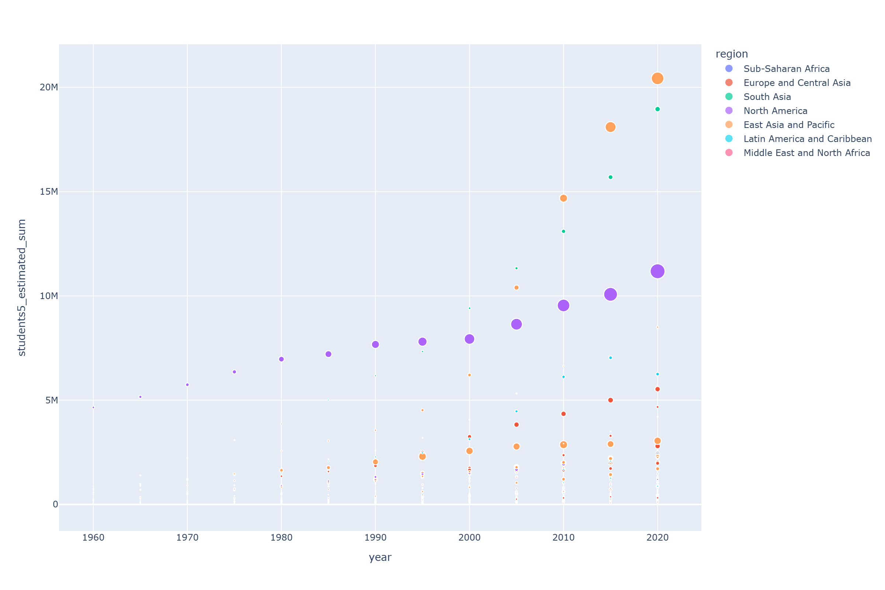
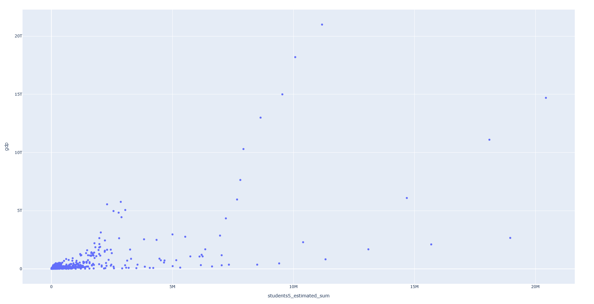
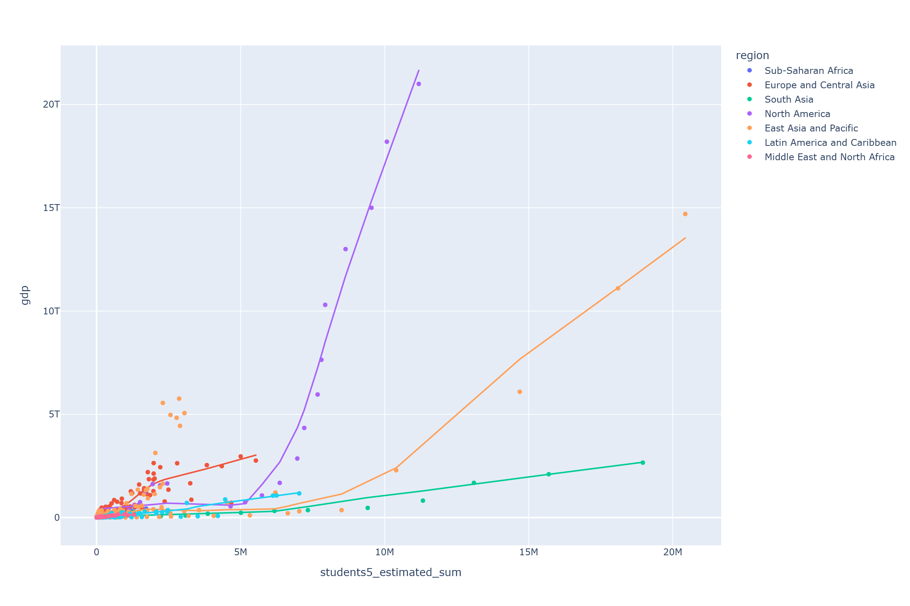
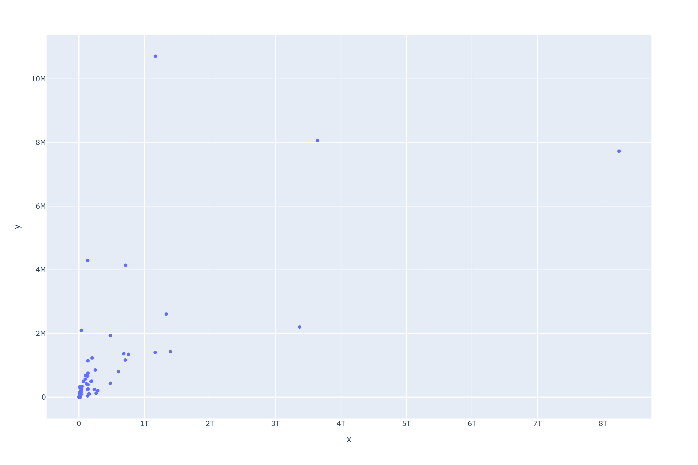

# GDP vs Enrollement
- Melted the gdp data, since each year was a column
- Joined based on country code, both datasets had the column
- Only joined the raw data, so gdp of every 5 years to match the enrollment data
    - I thought this would give the most accurate representation
- Plotted using the scatter plot, but tried to plot with GDP as the size of the point
    - This didn't quite give the correct relationship requested by the client, but did highlight some of the bigger GDP countries, the role the year plays, and that there may be groups in the data
    - Based on my world map plot of the enrollment data, I think that the region or income group may play a role

- Plotting just gdp vs enrollment (each point is a year) doesn't quite show a clear global trend, may be a trend of time. But it does look like there are some distinct groups 
    - There seems to be 4 trends that shoot up the gdp scale at different points
    - This may be income group, there are four categories
    - We also know at this point that region and income group are pretty closely tied

- Let's start with region, because an argument could be made for 5 trends, and we also saw some regional clustering in the scatter plot with points scaled by gdp
    - This seems to fit the trends pretty well
    - Added some trend lines to highlight the change

- Just to make sure, lets collapse across year and see what comes out
    - Nothing too revealing, seems like we destroyed some data

# Conclusion

- To conclude, it seems like enrollment does increase with GDP, however, how this scales may be regionally dependent 
