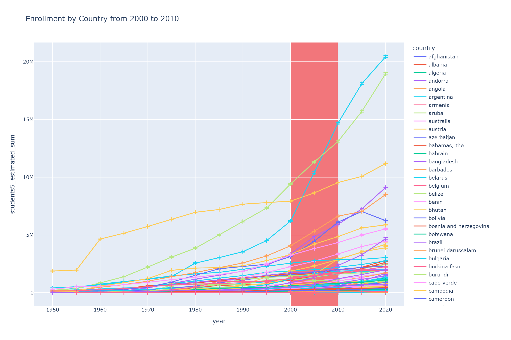
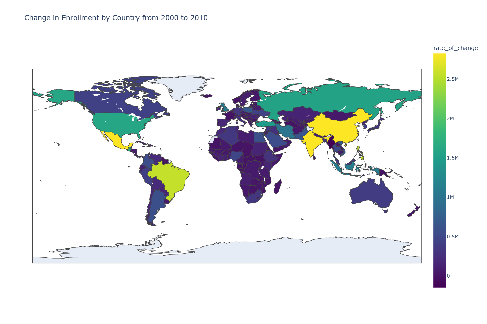
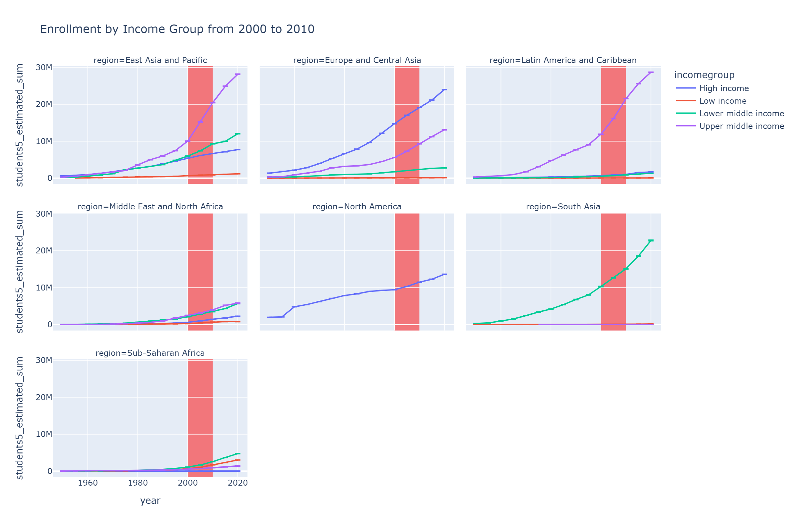
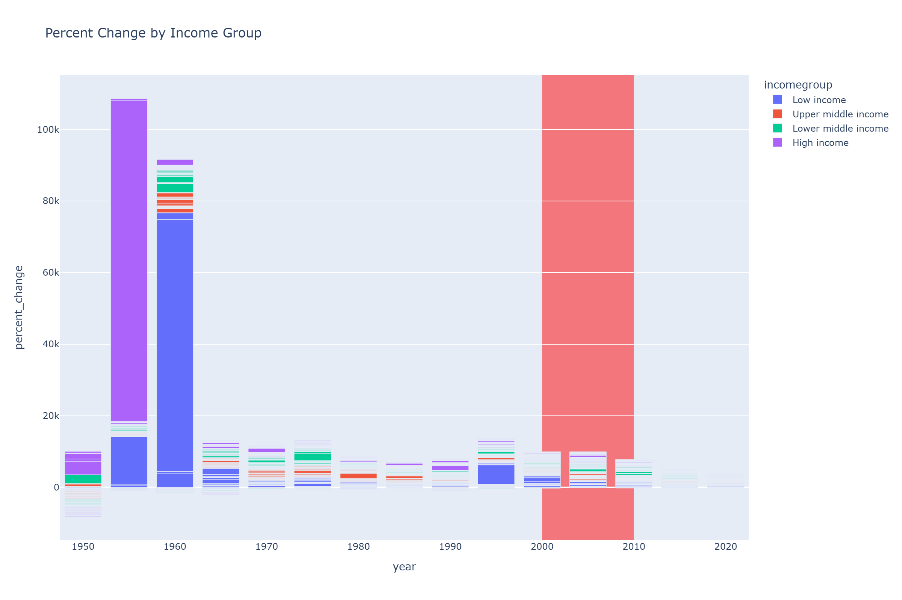
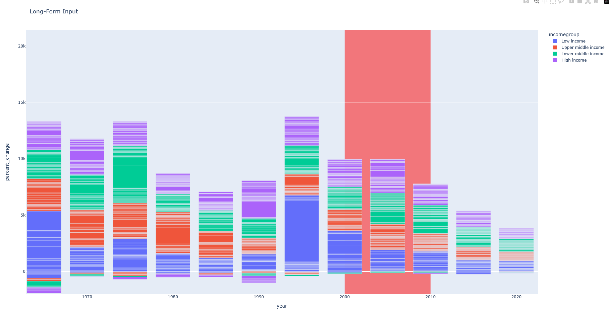
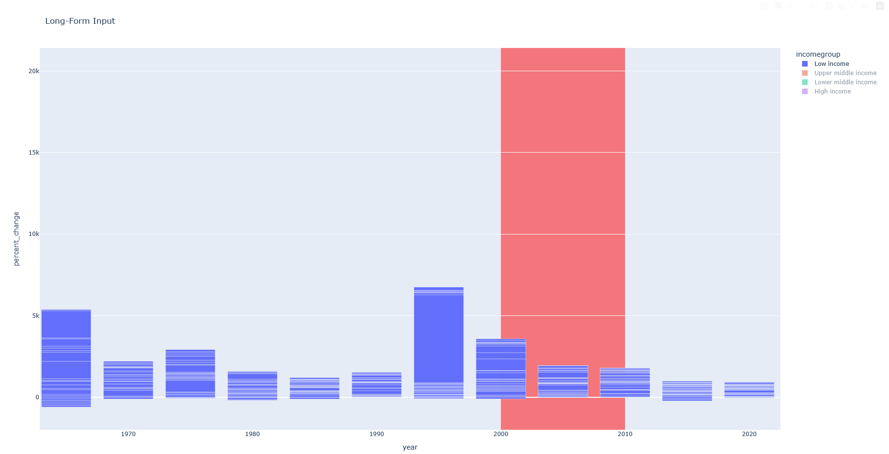
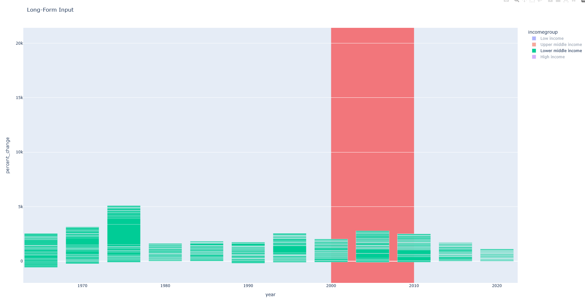
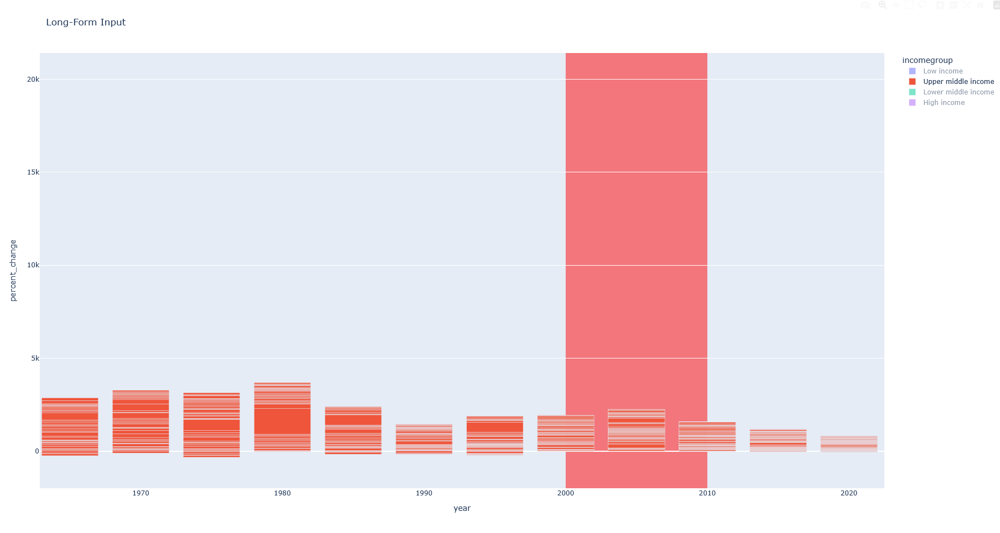
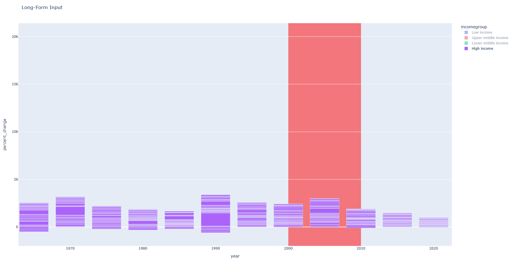

# Historical Event Detection
- I brainstormed some events I thought would have a significant effect on enrollment, but mostly came up with ideas that were very US centric.
- The idea that I came up with that would be more global was the 2008 Financial Crisis
- Before I looked at the data, my plan was to perform local minimum and maximum analysis or rate of change analysis to identify time windows that could suggest historical events.
- I was also considering smoothing the data to assist with this analysis, just doing a rolling window average to reduce the effects of noise.
- However, once I looked at the dataset, with the 5 year sample points, I felt this was smoothed enough and there might not be enough temporal resolution to this data to perform local minimum and maximum analysis.
- I still think we could do some rate of change analysis on these larger time windows.
- I grouped the data by country and year, and got a sum, to get a measure of total enrollment per country.
- I then plotted this information over time

- This figure suggested to me that total enrollment across a whole country does not usually go down, but it may slow down.
    - Again, this suggested to me that doing local minimum analysis may not be worth it given the time allowed for this exercise.

- Looking at the red window in the line chart (2000 - 2010), we actually see some major increases across most the countries.
    - In the png, it is tougher to tell, but in the interactive htmls, you can click through and isolate each country.
- Since I had an Country name column, I knew I could map the data on a world map quickly, to see if there were any geographical effects.
- I generated a difference between 2010 and 2000 total enrollment numbers and plotted it on the map bellow, curious to see if there were any countries that had decreases in this time window.

- You can clearly see the effects of population, and if I had the information in the dataset, I would have liked to have normalized to country population per year.
- The original version of this figure was really tough to really tell anything, because China's change was over 8 million, and India's was around 3.6 million, and all other countries we about 2 million and less.
    - Another point in the column for normalizing by country population.
- My original assumption that economic recession would lead to decreased enrollment (due to lack of economic resources to attend a university) was wrong
    - On the contrary, it seems that the lack of vocational options may have actually encouraged people to seek more education.

- However, that effect may be different per income level.
    - Really, the people who have the ability to attend university when they can't find a job may be the same people that had a higher level of economic resources.
    - We have an income group column

- I originally was going to explore this in a few countries that had the largest increases in the first line plot (US, China, India), assuming they had the best shot to demonstrate an effect.
- However, I quickly learned that each country has 1 income group designation.
- The original version of this figure was just broken down by income group and suggested the biggest increase was seen in the Upper- and Lower-Middle Income groups
- The effect was so drastic, and followed some of the outliers in the original line plot, that suggested to me that I needed to check country.
- The world plot also suggested regional differences, and potentially 1 or 2 large increases per region, so that also made me wonder if it was an income group effect.
- For a quick analysis, I added the income group information to the world plot, and in the interactive version was able to see that China was in the Upper-Middle Income group and India was in the Lower-Middle Income Group
- Breaking the plot out into region suggested distinct effect of income group
- However, its still tough to see, as the income group with the largest increase also seems to be the income group with the most countries per region

| region | incomegroup | country_count |
| --- | --- | --- |
| East Asia and Pacific | High income | 8 |
| East Asia and Pacific | Low income | 1 |
| East Asia and Pacific | Lower middle income | **9** |
| East Asia and Pacific | Upper middle income | 7 |
| Europe and Central Asia | High income | **34** |
| Europe and Central Asia | Low income | 1 |
| Europe and Central Asia | Lower middle income | 4 |
| Europe and Central Asia | Upper middle income | 14 |
| Latin America and Caribbean | High income | 8 |
| Latin America and Caribbean | Low income | 1 |
| Latin America and Caribbean | Lower middle income | 4 |
| Latin America and Caribbean | Upper middle income | **17** |
| Middle East and North Africa | High income | **8** |
| Middle East and North Africa | Low income | 2 |
| Middle East and North Africa | Lower middle income | 6 |
| Middle East and North Africa | Upper middle income | 5 |
| North America | High income | **2** |
| South Asia | Low income | 1 |
| South Asia | Lower middle income | **6** |
| South Asia | Upper middle income | 1 |
| Sub-Saharan Africa | High income | 2 |
| Sub-Saharan Africa | Low income | **23** |
| Sub-Saharan Africa | Lower middle income | 18 |
| Sub-Saharan Africa | Upper middle income | 5 |

- This then made we want to see how each income group stacked up per country based on percent change from the pervious year, to see if I could identify any patterns
    - This would also normalize the data a little, and see if we can see any clearer trends per income group

- This png is also tough to interpret because of the incredible increases the high income country in 1955 (Saudi Arabia) and the Low Income Country in 1960 (Madagascar)
    - I originally though these were artifacts and almost thought to exclude them
    - Turns out these were the periods of time in which these countries were establishing their first few universities
     - Saudi Arabia: Universities established in 1949, 1953, and 1957. With 6 students enrolled in a single university in 1955, and 5383 after the second university opened in 1953, we see the 89000% increase in the graph.
        - The discovery of oil in 1938 led to resources being available to invest in academic institutions, to make sure educational growth paced economic growth, leading to the establishment of universities across the 1950s.
    - Madagascar had 1 university in 1955, with 2 students enrolled. By 1960, there were 5 total universities, each with about 40 students, excluding the university established in 1955, which jumped to 1245, which would cause that large percent change.
        - Madagascar gained its independence from France in June 1960, which kicked off a want to develop their own national system.
    - These were somewhat spurious findings, but did identify historical events.
- In the interactive version of the plot, I was able to zoom in (Scaling the percent change to fit the data, and zooming the years to start in 1965) and explore a little further.

- We can see each income group a little more, and we do see the rate of change from the previous year start to decrease starting in 2010.
- When we look at the individual groups, we start to see that trend appear in the Low Income group even by 2005

- The rest of the income groups seem to have a peak in 2005 and then decrease.
- This could suggest that the economic effect of the "2008" Financial crisis were being felt by lower income countries earlier than the actual crash.
